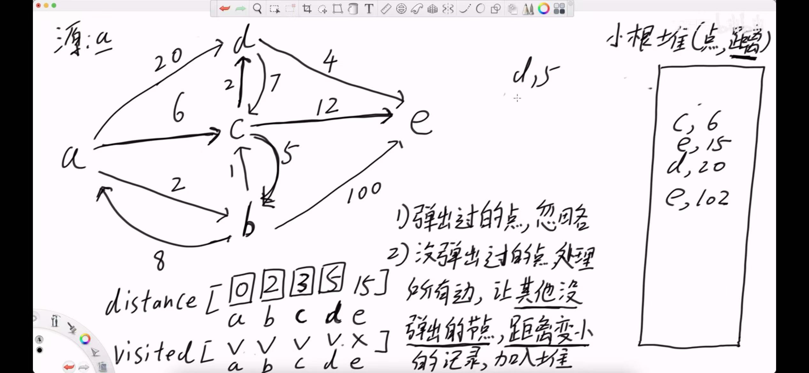

# Introduction
Dijkstra Algorithm 通常用来解决单源最短路径问题，在一个图中，点 u 到各个节点的最短路径是多少。

## Problem
[LeetCode 743. Network Delay Time](https://leetcode.cn/problems/network-delay-time/description/)

You are given a network of n nodes, labeled from 1 to n. You are also given times, a list of travel times as directed edges times[i] = (ui, vi, wi), where ui is the source node, vi is the target node, and wi is the time it takes for a signal to travel from source to target.

We will send a signal from a given node k. Return the minimum time it takes for all the n nodes to receive the signal. If it is impossible for all the n nodes to receive the signal, return -1.

Example 1:


```
Input: times = [[2,1,1],[2,3,1],[3,4,1]], n = 4, k = 2
Output: 2
```

## Analyze

- 考虑图的存储方式，可以用Map<Integer, List<int[]>> 存储带权的有向图。
- 设置一个 minDist[] 数组(这很重要!). 题目求 u 到其他节点的最短路径，抽象地将图分为两个部分：目前为止 u 可达的部分，u 还未可达的部分。一开始的时候，所有的节点都是不可达，
所以 minDist 初始化为 INF, 只有 minDist[u] = 0。
- 维护一个最小堆，PriorityQueue<int[]> pq, 存储 [node, distance], 代表 u 到 node 的距离。
- 维护一个 visit 数组，如果一个节点 v 到 u 的最短路径已经最终确认了，就把它标记为 visit[v] = true.
- 栈是一个辅助栈，节点可能会重复出现，但是因为每次只弹出最短的边，所以没关系。

## Template
```java
public static int networkDelayTime(int[][] times, int n, int k) {
        int INF = Integer.MAX_VALUE / 2;
        // 1. construct adj
        Map<Integer, List<int[]>> adj = new HashMap<>();
        for(int i=0;i<n+1;i++)
            adj.put(i, new ArrayList<>());

        for(int[] edge: times) {
            adj.get(edge[0]).add(new int[]{edge[1], edge[2]});
        }

        // 2. init minDist array
        int[] minDist = new int[n+1];
        Arrays.fill(minDist, INF);
        minDist[k] = 0;

        // 3. set up pq and visit set
        PriorityQueue<int[]> pq = new PriorityQueue<>((a, b) -> a[0]-b[0]);
        pq.offer(new int[]{0, k});
        Set<Integer> visit = new HashSet<>();

        int ans = 0, cnt = 0;
        while(!pq.isEmpty()) {
            int[] cur = pq.poll();
            // 到 u 的距离为 w1
            int w1 = cur[0], u = cur[1];

            if(w1 > minDist[u]) continue;

            // 否则当前到 u 的距离就是到 u 的最小距离
            minDist[u] = w1;
            visit.add(u);
            cnt++;

            ans = Math.max(ans, minDist[u]);
            if(ans == INF) return -1;

            for(int[] nei: adj.get(u)) {
                int v = nei[0], w2 = nei[1];
                // only when cur distance to v < minDist[v], update the res + queue
                if(!visit.contains(v) && minDist[v] > w1+w2) {
                    minDist[v] = w1+w2;
                    pq.offer(new int[]{minDist[v], v});
                }
            }
        }
        return cnt == n ? ans : -1;

    }
```
